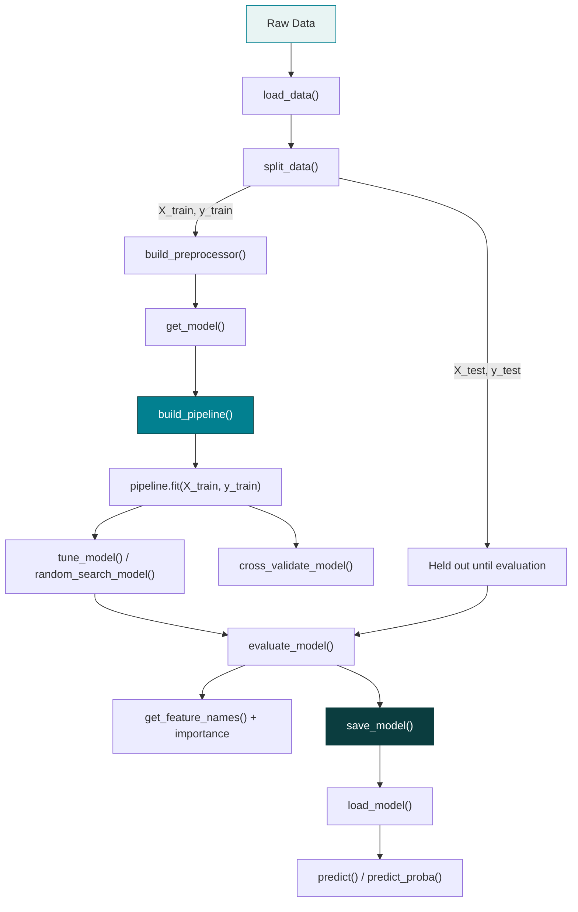

# ML Starter Kit

A reusable, modular machine learning framework so you never have to rewrite the same
`train_test_split()` / `Pipeline()` / `GridSearchCV()` boilerplate for every new project.
Built for BTech students learning ML engineering, following real industry practices:
DRY, single responsibility, configuration over hard-coding, and leakage-safe by design.

## Project Purpose

Every ML project repeats the same handful of steps: load data, split it, preprocess it,
pick a model, train, tune, evaluate, save, predict. This kit turns each of those steps into
a small, tested, reusable function — so a new project becomes:

```python
df = load_data("data/raw/customer.csv")
X_train, X_test, y_train, y_test = split_data(df, target="churn")
preprocessor = build_preprocessor(numerical_features, categorical_features)
model = get_model("logistic")
pipeline = build_pipeline(preprocessor, model)
pipeline.fit(X_train, y_train)
evaluate_model(pipeline, X_test, y_test)
```

...instead of forty lines of imports, `ColumnTransformer` setup, and encoder configuration
copy-pasted from your last project.

## Architecture



The core engineering rule this architecture enforces: **`split_data()` always happens
before anything is fit**, and every preprocessing step lives INSIDE the `Pipeline` built
by `build_pipeline()` — so it is structurally impossible to accidentally fit a scaler,
imputer, or encoder on data the model shouldn't have seen yet (see `src/data/splitter.py`
and `src/preprocessing/pipeline.py` for the full explanation).

## Installation

```bash
git clone <this-repo>
cd ml-starter-kit
pip install -r requirements.txt
```

Requires Python 3.10+ (the codebase uses modern type hints like `str | None`).

## Quick Start

```bash
# 1. Generate the bundled example dataset (or drop your own CSV into data/raw/)
python data/raw/generate_sample_data.py

# 2. Run the end-to-end notebook
jupyter notebook notebooks/01_end_to_end.ipynb
```

Or run it as a script:

```python
import sys; sys.path.insert(0, ".")

from src.data.loader import load_data
from src.data.splitter import split_data
from src.preprocessing.pipeline import build_preprocessor, build_pipeline
from src.models.factory import get_model
from src.evaluation.metrics import evaluate_model

df = load_data("data/raw/customer_churn.csv")
X_train, X_test, y_train, y_test = split_data(
    df.drop(columns=["customer_id"]), target="churn", stratify=True
)

numerical_features = X_train.select_dtypes(include="number").columns.tolist()
categorical_features = X_train.select_dtypes(exclude="number").columns.tolist()

preprocessor = build_preprocessor(numerical_features, categorical_features)
pipeline = build_pipeline(preprocessor, get_model("logistic"))
pipeline.fit(X_train, y_train)

print(evaluate_model(pipeline, X_test, y_test, task="classification"))
```

## Project Structure

```
ml-starter-kit/
├── configs/config.yaml            # experiment settings -- edit this, not the code
├── data/
│   ├── raw/                       # original data (generate_sample_data.py included)
│   ├── processed/                 # your saved intermediate outputs, if any
│   └── README.md
├── notebooks/
│   ├── 01_end_to_end.ipynb        # the full 16-step workflow, start to finish
│   ├── 02_regression.ipynb        # regression models + regularization path
│   ├── 03_classification.ipynb    # classification models + ROC/confusion matrix
│   └── 04_feature_engineering.ipynb  # transforms, selection, PCA
├── src/
│   ├── data/            loader.py, splitter.py
│   ├── preprocessing/   numerical.py, categorical.py, pipeline.py
│   ├── feature_engineering/  transformation.py, selection.py, dimensionality_reduction.py
│   ├── models/          factory.py, regression.py, classification.py, regularization.py
│   ├── evaluation/      metrics.py, cross_validation.py, model_selection.py, importance.py
│   └── utils/           logger.py, io.py, config.py, visualization.py
└── tests/                test_loader.py, test_preprocessing.py, test_models.py
```

## Supported Models

Call `list_available_models()` at any time for the live list. Currently registered:

| Task | Names |
|---|---|
| Regression | `linear` / `linear_regression`, `ridge`, `lasso`, `elasticnet`, `decision_tree_regressor`, `random_forest_regressor`, `gradient_boosting_regressor` |
| Classification | `logistic` / `logistic_regression`, `decision_tree_classifier`, `random_forest_classifier`, `gradient_boosting_classifier`, `knn`, `svm` |

## Example Usage

**Cross-validation:**
```python
from src.evaluation.cross_validation import cross_validate_model
results = cross_validate_model(pipeline, X_train, y_train, cv=5, scoring="roc_auc")
print(results["mean"], results["std"])
```

**Hyperparameter tuning:**
```python
from src.evaluation.model_selection import tune_model
tuned = tune_model(pipeline, param_grid={"model__C": [0.01, 0.1, 1, 10]}, X=X_train, y=y_train, cv=5)
best_pipeline = tuned["best_estimator_"]
```

**Comparing several models at once:**
```python
from src.evaluation.model_selection import compare_models
results_df = compare_models(
    model_names=["logistic", "random_forest_classifier", "knn"],
    preprocessor=preprocessor, X_train=X_train, y_train=y_train, X_test=X_test, y_test=y_test,
)
```

**Feature importance (with correct names after one-hot encoding):**
```python
from src.evaluation.importance import get_feature_names, tree_feature_importance
names = get_feature_names(fitted_pipeline)
importance_df = tree_feature_importance(fitted_pipeline, feature_names=names)
```

**Save, load, predict on new raw data:**
```python
from src.utils.io import save_model, load_model, predict
save_model(pipeline, "models/churn_model.joblib")
loaded = load_model("models/churn_model.joblib")
predict(loaded, new_raw_dataframe)   # imputation/scaling/encoding happen automatically
```

## How to Add a New Model

Two ways:

1. **Built into the kit permanently** — add one line to the registry dict in
   `src/models/regression.py` or `src/models/classification.py`:
   ```python
   from xgboost import XGBRegressor
   REGRESSION_MODELS["xgboost"] = XGBRegressor
   ```

2. **From your own project code, without editing the framework** — use `register_model()`:
   ```python
   from src.models.factory import register_model
   from xgboost import XGBRegressor
   register_model("xgboost", XGBRegressor, task="regression")
   model = get_model("xgboost", n_estimators=200)
   ```

## How to Add a New Transformer

Preprocessing pipelines are built from plain scikit-learn `Pipeline` objects, so anything
scikit-learn-compatible works. To add a new numeric scaling option, for example, edit
`src/preprocessing/numerical.py`'s `_SCALERS` dict:
```python
from sklearn.preprocessing import Normalizer
_SCALERS["normalize"] = Normalizer
```
Then `build_numeric_pipeline(scaling="normalize")` works immediately.

## How to Run Tests

```bash
pip install pytest   # if not already installed
pytest tests/ -v
```

19 tests currently cover data loading (valid files, missing files, unknown extensions),
preprocessing (imputation, scaling, safe handling of unseen categories, leakage-safety),
and the model factory (correct instantiation, hyperparameter pass-through, clear errors
for unknown model names, and the `register_model()` extension point).

## Configuration

Edit `configs/config.yaml` to change an experiment without touching code:

```yaml
data:
  path: data/raw/customer_churn.csv
  target: churn
split:
  test_size: 0.2
  random_state: 42
  stratify: true
model:
  name: logistic
  parameters:
    C: 1.0
```

Load it with `from src.utils.config import load_config`.

## Important Engineering Rules This Kit Enforces

- **Never fit preprocessing on test data.** `split_data()` always runs before any
  preprocessing step is fit.
- **Never fit on the full dataset before splitting.** Every example in this README and
  in `notebooks/01_end_to_end.ipynb` splits first.
- **One Pipeline object, always.** `build_pipeline()` bundles preprocessing and the model
  together, so train and inference use IDENTICAL transformation logic — there is no
  separate "prediction-time preprocessing code" to accidentally get out of sync.
- **`random_state` is set everywhere** it matters, for reproducibility.
- **Errors are explicit, not silent.** A missing target column, an unknown model name, a
  chi2 selector fed negative values — all raise a clear `ValueError` explaining exactly
  what went wrong, rather than failing mysteriously three steps later.
